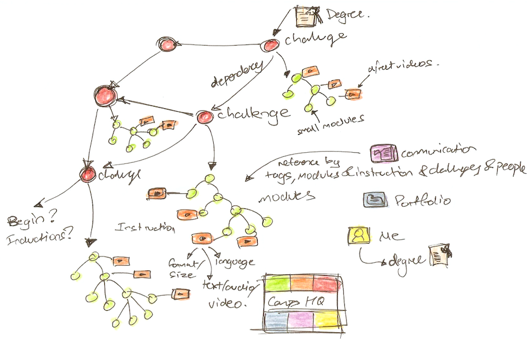
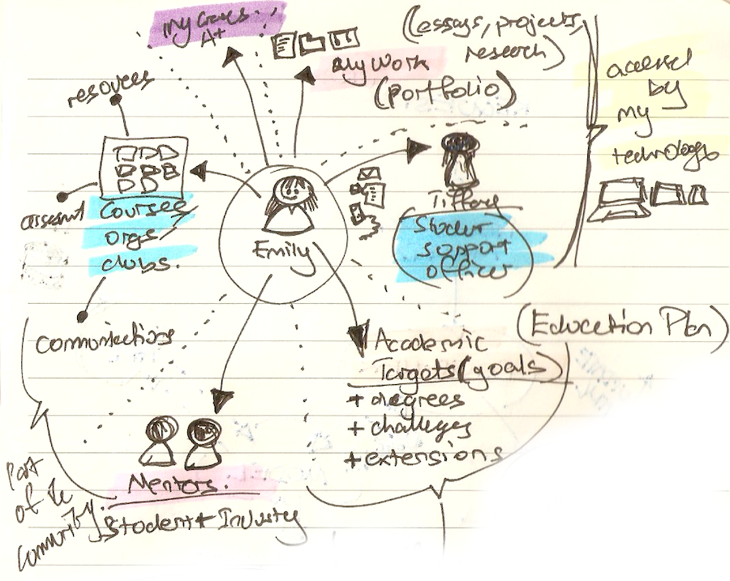
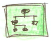
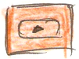
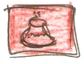
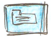
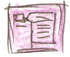
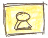

# [Campus](https://github.com/dbtedman/kata-campus)

> **⚠️ WARNING:** Not production ready code, instead a [Code Kata](https://github.com/dbtedman#code-kata) intended to
> hone my programming skills through practice and repetition.

[](https://github.com/dbtedman/kata-campus/actions/workflows/ci.yml)
[](https://github.com/dbtedman/kata-campus/actions/workflows/sast.yml)


Campus headquarters for your personal learning platform.

-   [Getting Started](#getting-started)
-   [Verification](#verification)
-   [Design](#design)
-   [References](#references)
-   [License](#license)

## Getting Started

```shell
nvm use && make
```

## Verification

### Linting

-   [ESLint](https://eslint.org)
-   [KTLint](https://ktlint.github.io)
-   [Prettier](https://prettier.io)

```shell
make lint
```

These rules can then be automatically applied:

```shell
make format
```

## Design

### Clean Architecture

Code within this repository is organised around principles
from [Clean Architecture](https://blog.cleancoder.com/uncle-bob/2012/08/13/the-clean-architecture.html).

> Paths are relative to the `com.danieltedman.katacampus` namespace.

| Path                      | Purpose                                                                                                         |
| ------------------------- | --------------------------------------------------------------------------------------------------------------- |
| `api`                     | Restful API that supports SPA.                                                                                  |
| `internal.domain.entity`  | Represents things in the system. Should not be accessed directly, only accesses the outside world via gateways. |
| `internal.domain.usecase` | Manages the interaction between gateways, entities, and ports (api/web).                                        |
| `internal.gateway`        | Gateways provide access to external resources such as the file system or a database.                            |
| `web`                     | Suppports rendering of SPA interface.                                                                           |

### Concepts

> 💡 Initially based around sketched ideas collected while considering what this platform would be. These concepts will
> be refined over time.

#### Dependency Model



#### Personal Educational Platform



#### Modules (Exercises)



Small focused exercises. These exercises are closely related to the instructional videos.

#### Videos (Instruction)



Short instructional videos on specific topics.

#### Projects



Each student has a customized series of projects assigned to them based on their goals and aspirations. Each project is
supported by a series of videos and modules. These projects will make up what is now considered to be a degree.

#### Portfolio



A collection of the students work throughout their studies. This will also include module activity and video viewership.

#### Communication



A singular communications platform to support a variety of different methods of communication.

#### Me



This section enables students to manage their education via a simple interface.

### Domain Entities

_Placeholder_

### Domain Use Cases

_Placeholder_

### Gateways

_Placeholder_

### Security Mitigations

> Initially based on the [OWASP Top 10 - 2021](https://owasp.org/www-project-top-ten/).

#### [A01:2021-Broken Access Control](https://owasp.org/Top10/A01_2021-Broken_Access_Control/)

[Github Security](https://github.com/features/security) detects secrets incorrectly committed into the repository.

#### [A02:2021-Cryptographic Failures](https://owasp.org/Top10/A02_2021-Cryptographic_Failures/)

_Placeholder_

#### [A03:2021-Injection](https://owasp.org/Top10/A03_2021-Injection/)

_Placeholder_

#### [A04:2021-Insecure Design](https://owasp.org/Top10/A04_2021-Insecure_Design/)

_Placeholder_

#### [A05:2021-Security Misconfiguration](https://owasp.org/Top10/A05_2021-Security_Misconfiguration/)

_Placeholder_

#### [A06:2021-Vulnerable and Outdated Components](https://owasp.org/Top10/A06_2021-Vulnerable_and_Outdated_Components/)

[Snyk](https://snyk.io) and [Github Security](https://github.com/features/security) scan Gradle and NPM dependencies for
know vulnerabilities and create pull requests to resolve the vulnerabilities when available.

#### [A07:2021-Identification and Authentication Failures](https://owasp.org/Top10/A07_2021-Identification_and_Authentication_Failures/)

_Placeholder_

#### [A08:2021-Software and Data Integrity Failures](https://owasp.org/Top10/A08_2021-Software_and_Data_Integrity_Failures/)

_Placeholder_

#### [A09:2021-Security Logging and Monitoring Failures](https://owasp.org/Top10/A09_2021-Security_Logging_and_Monitoring_Failures/)

_Placeholder_

#### [A10:2021-Server-Side Request Forgery](https://owasp.org/Top10/A10_2021-Server-Side_Request_Forgery_%28SSRF%29/)

_Placeholder_

## References

-   2022-06-12: [How to add live reload to esbuild server](https://how-to.dev/how-to-add-live-reload-to-esbuild-server)
-   2022-06-12: [KTLint Gradle](https://github.com/JLLeitschuh/ktlint-gradle)
-   2022-06-12: [React Redux](https://react-redux.js.org/tutorials/quick-start)
-   2022-06-12: [React Router](https://reactrouterdotcom.fly.dev/docs/en/v6)
-   2022-06-12: [React Testing Library](https://testing-library.com/docs/react-testing-library/example-intro)
-   2022-06-12: [Redux Saga](https://redux-saga.js.org)

## License

The [MIT License](./LICENSE.md) is used by this project.
